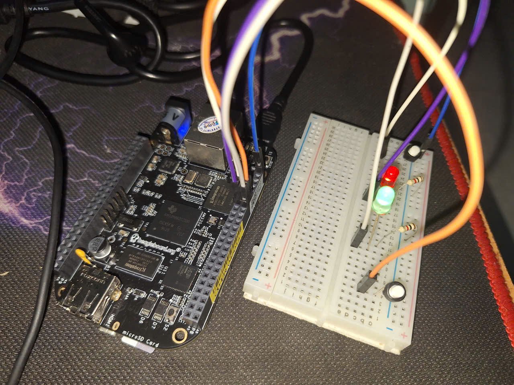

# BÁO CÁO MOCK PROJECT: LẬP TRÌNH KERNEL DRIVER TRÊN BEAGLEBONE BLACK

**Họ và tên:** Nguyễn Tuấn Đạt  
**Dự án:** Viết Driver điều khiển LED (GPIO) bật tắt  
**Phiên bản Kernel mục tiêu:** 6.18.16-bone23  

---

## 1. Chuẩn bị môi trường và Tải mã nguồn Kernel

Để biên dịch một Kernel Module (LKM), chúng ta cần mã nguồn Kernel tương ứng với phiên bản đang chạy trên thiết bị để các symbol và header file hoàn toàn khớp nhau.

### 1.1. Clone Repository quản lý build
Sử dụng bộ công cụ của Robert C. Nelson – người duy trì chính cho các bản phân phối Debian trên BeagleBone.

```bash
# Clone repo chứa script cấu hình kernel
git clone [https://github.com/RobertCNelson/bb-kernel.git](https://github.com/RobertCNelson/bb-kernel.git) kernel-source
cd kernel-source

# Chuyển sang đúng Tag phiên bản 6.18.16
git checkout 6.18.16-bone23 -b my-kernel
```

### 1.2. Tải và cấu hình mã nguồn Kernel thực sự

Việc chạy script này giúp tải mã nguồn từ kernel.org và cấu hình các file header cần thiết cho việc biên dịch module sau này.

```bash
# Lệnh này sẽ giải nén mã nguồn vào thư mục ./KERNEL
./build_kernel.sh
```
## 2. Thiết lập Biên dịch chéo (Cross-Compile)

### 2.1. Cài đặt Toolchain

Vì biên dịch trên máy X86 (Ubuntu) cho chip ARM (BeagleBone), ta cần bộ compiler chuyên dụng:

```bash
sudo apt update
sudo apt install gcc-arm-linux-gnueabihf
```

### 2.2. Biến môi trường

Mọi lệnh biên dịch sẽ được thực hiện với các tham số:
- ARCH=arm: Chỉ định kiến trúc mục tiêu.
- CROSS_COMPILE=arm-linux-gnueabihf-: Đường dẫn tới prefix của compiler.

## 3. Thiết kế hệ thống Driver theo mô hình Modular

Trong dự án này, hệ thống không được thiết kế dưới dạng một Driver đơn khối (Monolithic) mà được chia thành các Module riêng biệt để tăng tính linh hoạt và khả năng tái sử dụng.

### 3.1. Kiến trúc hệ thống
Hệ thống bao gồm 3 thành phần chính:
* **Glue Module:** Đóng vai trò là lớp trung gian (Middleware) thực hiện cơ chế Loosely Coupled (ghép nối lỏng) giữa LED và Button driver; module này cung cấp các API được Export Symbol để quản lý việc đăng ký thiết bị (glue_register_led) và điều phối tín hiệu điều khiển (glue_toggle_led), cho phép Button driver có thể tác động trực tiếp lên LED driver thông qua các hàm callback trong Kernel-space mà không phụ thuộc vào thứ tự nạp module. Không chỉ là cầu nối, module giờ đây đóng vai trò là State Machine Manager. Nó quản lý trạng thái của từng LED thông qua các chế độ: MODE_TOGGLE, MODE_BLINK, và MODE_OFF. Module cung cấp giao diện /dev/bbb_glue để Userspace có thể thay đổi hành vi của hệ thống thông qua các lệnh IOCTL.
* **LED: Driver:** Được thiết kế theo mô hình Platform Driver kết hợp Character Device, đóng vai trò là lớp thực thi phần cứng trực tiếp trong hệ thống. Driver quản lý 02 LED thông qua GPIO Descriptor dựa trên cấu hình từ Device Tree, hỗ trợ điều khiển linh hoạt từ cả Userspace (qua /dev/led) và Kernel-space (thông qua cơ chế đăng ký với Glue Module). Đặc biệt, module đảm bảo tính ổn định và an toàn hệ thống bằng cách sử dụng Mutex lock để chống xung đột khi truy cập đồng thời và áp dụng cơ chế Managed Resources (devm) giúp tối ưu hóa việc quản lý tài nguyên.
* **Button Driver:** Được xây dựng theo mô hình Platform Driver tích hợp khả năng xử lý Ngắt cứng (Interrupt), đóng vai trò là lớp tiếp nhận sự kiện từ người dùng. Driver quản lý các nút nhấn thông qua cơ chế Interrupt Service Routine (ISR), sử dụng kỹ thuật Debouncing bằng phần mềm qua biến jiffies để loại bỏ hiện tượng nhiễu tín hiệu vật lý. Về mặt giao tiếp, module hỗ trợ cơ chế Blocking Read thông qua Wait Queue, cho phép ứng dụng Userspace (tại /dev/all_buttons) tạm dừng và chỉ tiếp tục chạy khi có sự kiện nhấn nút thực tế, giúp tối ưu hóa hiệu năng CPU. Đồng thời, driver liên kết trực tiếp với Glue Module để kích hoạt các phản hồi hệ thống ngay trong ngữ cảnh ngắt, đảm bảo tính thời gian thực cho thiết bị.

### 3.2. Luồng hoạt động (Workflow)
Hệ thống hoạt động dựa trên sự phối hợp chặt chẽ giữa ba tầng module, đảm bảo tính tách biệt giữa logic điều khiển và tương tác phần cứng.

1.  **Giai đoạn Khởi tạo (Initialization):** Glue Module phải được nạp đầu tiên vào Kernel. Module này khởi tạo một mảng chứa các con trỏ gpio_desc và export các hàm API ra toàn hệ thống. Lúc này, hệ thống sẵn sàng làm "cầu nối" nhưng chưa có thiết bị nào được kết nối.
2.  **Giai đoạn Đăng ký Thiết bị (Registration):** 
    * Khi LED Driver được insmod, nó sẽ thực hiện probe từ Device Tree, lấy Descriptor của LED và ngay lập tức gọi hàm glue_register_led(). Thông tin về chân GPIO của LED giờ đây đã nằm trong tầm quản lý của Glue Module.
    * Khi Button Driver được insmod, nó thiết lập ngắt cứng (IRQ) cho nút nhấn. Driver này không cần biết LED nằm ở đâu, nó chỉ cần liên kết với Glue Module để chuẩn bị cho việc phát tin hiệu.
3.  **Giai đoạn Xử lý Sự kiện (Runtime Event):** 
    * Khi người dùng nhấn nút, một tín hiệu ngắt được gửi đến CPU. Hàm xử lý ngắt (ISR) trong Button Driver được kích hoạt.
    * Thay vì điều khiển LED trực tiếp, Button Driver gọi hàm glue_toggle_led().
    * Glue Module nhận yêu cầu, kiểm tra xem LED tương ứng đã được đăng ký chưa (tránh lỗi null pointer) rồi mới ra lệnh thay đổi mức logic trên chân GPIO của LED.
4.  **Luồng điều khiển từ Userspace (IOCTL):** 
    * Ứng dụng người dùng gửi cấu trúc bbb_ioctl_data qua file /dev/bbb_glue.
    * Kernel thực hiện copy_from_user, kiểm tra tính hợp lệ và cập nhật chế độ hoạt động (modes[i]).
    * Nếu chuyển sang MODE_BLINK, một Kernel Timer sẽ được kích hoạt để đảo trạng thái LED sau mỗi 500ms mà không cần sự can thiệp tiếp theo từ người dùng hay nút bấm.
5. **Xử lý đồng thời và An toàn (Concurrency):**
    * Sử dụng mutex_lock để bảo vệ mảng led_gpios và modes khi có sự tranh chấp giữa ISR (ngắt nút bấm), Timer callback, và IOCTL call.
    * Sử dụng timer_delete_sync để đảm bảo khi hủy đăng ký LED hoặc đổi chế độ, không có tiến trình ngầm nào còn ghi dữ liệu vào vùng nhớ đã giải phóng.
6.  **Giai đoạn Giải phóng (Cleanup):** Khi một trong hai driver thiết bị bị gỡ (rmmod), nó sẽ gọi hàm unregister trong Glue Module để xóa con trỏ descriptor, đảm bảo an toàn cho Kernel, tránh việc gọi vào một vùng nhớ không còn tồn tại.

### 3.3. Chi tiết các Driver thành phần

#### A. Glue Module (Trạm trung chuyển)
Đóng vai trò là "bộ não" điều phối toàn hệ thống, thực hiện cơ chế ghép nối lỏng (Loosely Coupled) và quản lý trạng thái logic thay vì trực tiếp thao tác phần cứng.
- Quản lý trạng thái: Sử dụng mô hình State Machine để quản lý 03 chế độ hoạt động cho từng LED: MODE_TOGGLE (Đảo trạng thái), MODE_BLINK (Nháy đèn qua Kernel Timer), và MODE_OFF (Tắt cưỡng bức).
- Giao diện lập trình (API): 
    * glue_register_led() / unregister: Tiếp nhận và giải phóng các GPIO Descriptor từ LED Driver thông qua cơ chế Export Symbol.
    * glue_handle_button_event(): Hàm xử lý sự kiện ngắt từ Button Driver để thực thi logic tương ứng với chế độ đang thiết lập.
- Điều phối từ Userspace: Cung cấp file thiết bị /dev/bbb_glue hỗ trợ các lệnh IOCTL (BBB_IOC_SET_MODE) cho phép người dùng thay đổi hành vi hệ thống theo thời gian thực.
- An toàn hệ thống: Sử dụng Mutex để đồng bộ hóa truy cập giữa các luồng và timer_delete_sync để đảm bảo an toàn khi dừng hoạt động các Timer.
#### B. LED Driver (Platform & Char Driver)
- Phần cứng: Quản lý 02 LED tại chân P8_13 và P8_14 thông qua cơ chế Resource Mapping từ Device Tree.
- Giao tiếp: - Tạo file thiết bị /dev/led
- Gọi symbol_get để liên kết với Glue Module ngay khi nạp (init).
- An toàn: Sử dụng Mutex lock để đảm bảo quá trình ghi giá trị xuống GPIO không bị chồng lấn khi có nhiều yêu cầu cùng lúc.

#### C. Button Driver (Interrupt Handling)
- Phần cứng: Cấu hình chân P8_11 và P8_12 là ngõ vào (Input).
- Cơ chế ngắt: Đăng ký ngắt với Kernel qua devm_request_irq, cấu hình kích hoạt tại cả hai cạnh (Rising & Falling).
- Xử lý: - Debounce: Kiểm tra biến jiffies để lọc nhiễu nút bấm trong khoảng 200ms.
    - Callback: Gọi trực tiếp glue_toggle_led() khi phát hiện sự kiện nhấn nút hợp lệ.
    - Blocking Read: Sử dụng Wait Queue để tối ưu hóa ứng dụng người dùng khi chờ đọc trạng thái nút.

## 4. Cấu hình Device Tree (DTS)
Để các Driver được tích hợp sẵn (Built-in) có thể nhận diện và điều khiển phần cứng ngay khi Kernel khởi động, hệ thống sử dụng Device Tree Source (.dtsi) để định nghĩa cấu hình chân (Pinmux) và các thuộc tính của thiết bị.

### 4.1. Phân tích file cấu hình bbb-gpio.dtsi
File cấu hình thực hiện hai nhiệm vụ chính:
- Pinmux Configuration: Thiết lập chế độ hoạt động cho các chân I/O của chip AM335x.
    - Pinmux Configuration: Thiết lập chế độ hoạt động cho các chân I/O của chip AM335x.
    - Buttons: Cấu hình chân GPMC_AD13 và AD12 về MUX_MODE7, chế độ INPUT_PULLUP để đảm bảo trạng thái ổn định khi nút không nhấn.
- Device Node Definition: Tạo các thực thể thiết bị để Kernel thực hiện quá trình Matching.
    - Sử dụng chuỗi compatible = "bbb,led-driver" và "bbb,button-driver" để khớp với of_match_table trong mã nguồn C.
    - Khai báo tài nguyên GPIO thông qua các thuộc tính led-gpios và button-gpios trỏ tới controller &gpio0 và &gpio1.
### 4.2. Nội dung chi tiết file cấu hình

```dtsi
/dts-v1/;
#include <dt-bindings/gpio/gpio.h>
#include <dt-bindings/pinctrl/am33xx.h>

/ {
    /* Khai báo thực thể LED */
    my_leds: my_leds {
        compatible = "bbb,led-driver";
        status = "okay";
        led-gpios = <&gpio0 23 GPIO_ACTIVE_HIGH>, /* Pin P8.13 */
                    <&gpio0 26 GPIO_ACTIVE_HIGH>; /* Pin P8.14 */
        led-names = "led1", "led2";
        pinctrl-names = "default";
        pinctrl-0 = <&led_pins>;
    };

    /* Khai báo thực thể Buttons */
    my_buttons: my_buttons {
        compatible = "bbb,button-driver";
        status = "okay";
        button-gpios = <&gpio1 13 GPIO_ACTIVE_LOW>, /* Pin P8.11 */
                       <&gpio1 12 GPIO_ACTIVE_LOW>; /* Pin P8.12 */
        button-names = "btn1", "btn2";
        pinctrl-names = "default";
        pinctrl-0 = <&button_pins>;
    };
};

&am33xx_pinmux {
    /* Cấu hình Pin Multiplexing */
    led_pins: led_pins {
        pinctrl-single,pins = <
            AM33XX_PADCONF(AM335X_PIN_GPMC_AD9,  PIN_OUTPUT_PULLDOWN, MUX_MODE7)
            AM33XX_PADCONF(AM335X_PIN_GPMC_AD10, PIN_OUTPUT_PULLDOWN, MUX_MODE7)
        >;
    };

    button_pins: button_pins {
        pinctrl-single,pins = <
            AM33XX_PADCONF(AM335X_PIN_GPMC_AD13, PIN_INPUT_PULLUP, MUX_MODE7)
            AM33XX_PADCONF(AM335X_PIN_GPMC_AD12, PIN_INPUT_PULLUP, MUX_MODE7)
        >;
    };
};
```
### 4.3. Quá trình nạp Device Tree
Vì Driver được build dạng built-in, file .dtsi này được biên dịch thành .dtb và nạp bởi Bootloader (U-Boot) trước khi Kernel chạy. Khi hàm platform_driver_register() được gọi, Kernel sẽ tự động quét cây thiết bị, tìm các node có compatible khớp và gọi hàm probe() của driver để khởi tạo phần cứng.

## 5. Tích hợp Driver vào hệ thống (Kernel Built-in)
Thay vì nạp thủ công, hệ thống được cấu hình để Driver tự động khởi tạo cùng Kernel, giúp tăng tính ổn định và tối ưu hóa tài nguyên cho thiết bị BeagleBone Black.

Cấu trúc project

```
drivers/misc/bbb_mydriver/
├── Kconfig
├── Makefile
├── button_driver.c
├── led_driver.c
├── bbb_glue.c
├── bbb_glue.h
└── bbb_glue_ioctl.h

arch/arm/boot/dts/ti/omap/
├── am335x-boneblack.dts          
└── am335x-boneblack-mydriver.dtsi  
```

### 5.1. Cấu hình nội bộ thư mục bbb_mydriver
* Tạo thư mục drivers/misc/bbb_my_mydriver trong source kernel đã clone ở mục 1. Chuyển các file drivers như bbb_glue.c, bbb_glue.h, bbb_glue_ioctl.h, button_driver.c, led_driver.c vào thư mục này.
* Trong thư mục vừa tạo, cần khai báo cách build các file đơn lẻ.
* Tệp Kconfig (nằm trong bbb_mydriver/):

```bash
config BBB_MYDRIVER
    bool "BBB Button/LED Driver"
    depends on ARCH_OMAP2PLUS
    default y
    help
      Built-in driver for BeagleBone Black button and LED. Includes button_driver, led_driver, and bbb_glue.
```
* Tệp Makefile (nằm trong bbb_mydriver/):
```makefile
obj-$(CONFIG_BBB_MYDRIVER) += bbb_mydriver.o

bbb_mydriver-objs := button_driver.o \
                     led_driver.o \
                     bbb_glue.o
```

### 5.2. Kết Nối Vào Makefile và Kconfig Cha

* Thêm vào drivers/misc/Makefile:
```bash
echo 'obj-$(CONFIG_BBB_MYDRIVER) += bbb_mydriver/' >> ~/kernel-source/KERNEL/drivers/misc/Makefile
```

* Thêm vào drivers/misc/Kconfig (trước dòng endmenu):
```bash
sed -i '/^endmenu/i source "drivers/misc/bbb_mydriver/Kconfig"' ~/kernel-source/KERNEL/drivers/misc/Kconfig
```

* Kiểm tra:
```bash
tail -3 ~/kernel-source/KERNEL/drivers/misc/Makefile
grep "bbb_mydriver" ~/kernel-source/KERNEL/drivers/misc/Kconfig
```

### 5.3. Tạo File Device Tree (.dtsi)

* Lưu vào arch/arm/boot/dts/ti/omap/am335x-boneblack-mydriver.dtsi:
```dsti
/ {
    my_leds: my_leds {
        compatible = "bbb,led-driver";
        status = "okay";

        led-gpios = <&gpio0 23 GPIO_ACTIVE_HIGH>,
                    <&gpio0 26 GPIO_ACTIVE_HIGH>;

        led-names = "led1", "led2";

        pinctrl-names = "default";
        pinctrl-0 = <&led_pins>;
    };

    my_buttons: my_buttons {
        compatible = "bbb,button-driver";
        status = "okay";

        button-gpios = <&gpio1 13 GPIO_ACTIVE_LOW>,
                       <&gpio1 12 GPIO_ACTIVE_LOW>;

        button-names = "btn1", "btn2";

        pinctrl-names = "default";
        pinctrl-0 = <&button_pins>;
    };
};

&am33xx_pinmux {
    led_pins: led_pins {
        pinctrl-single,pins = <
            AM33XX_PADCONF(AM335X_PIN_GPMC_AD9,  PIN_OUTPUT_PULLDOWN, MUX_MODE7)
            AM33XX_PADCONF(AM335X_PIN_GPMC_AD10, PIN_OUTPUT_PULLDOWN, MUX_MODE7)
        >;
    };

    button_pins: button_pins {
        pinctrl-single,pins = <
            AM33XX_PADCONF(AM335X_PIN_GPMC_AD13, PIN_INPUT_PULLUP, MUX_MODE7)
            AM33XX_PADCONF(AM335X_PIN_GPMC_AD12, PIN_INPUT_PULLUP, MUX_MODE7)
        >;
    };
};
```

* Include vào file DTS gốc, thêm 1 dòng vào cuối arch/arm/boot/dts/ti/omap/am335x-boneblack.dts:
```dts
/* ... nội dung file gốc ... */
&baseboard_eeprom {
        vcc-supply = <&ldo4_reg>;
};

#include "am335x-boneblack-mydriver.dtsi"   /* ← thêm dòng này */
```

### 5.4. Build Kernel

* Lấy Config Kernel Gốc Của BBB

```bash
# Copy config gốc từ board về
scp debian@192.168.7.2:/boot/config-6.18.16-bone23 \
    ~/kernel-source/KERNEL/.config

# Thêm config driver vào
echo "CONFIG_BBB_MYDRIVER=y" >> ~/kernel-source/KERNEL/.config

# Update config
export ARCH=arm
export CROSS_COMPILE=/path/to/arm-linux-gnueabi-

make olddefconfig

# Kiểm tra
grep "CONFIG_BBB_MYDRIVER" .config
# Phải thấy: CONFIG_BBB_MYDRIVER=y
```
* Build kernel

```bash
export ARCH=arm
export CROSS_COMPILE=/home/tuandat/kernel-source/dl/gcc-15.2.0-nolibc/arm-linux-gnueabi/bin/arm-linux-gnueabi-

make -j$(nproc) zImage dtbs modules
```
* Kết quả mong đợi
```bash
Kernel: arch/arm/boot/zImage is ready
DTC     arch/arm/boot/dts/ti/omap/am335x-boneblack.dtb
```

* Deploy Lên BBB Qua SD Card
    * Cắm SD card vào máy host, kiểm tra mount
    ```bash
    lsblk
    ```
    * Backup kernel cũ
    ```bash
    sudo cp /media/tuandat/rootfs/boot/vmlinuz-6.18.16-bone23 /media/tuandat/rootfs/boot/vmlinuz-6.18.16-bone23.bak
    ```
    * Copy kernel mới
    ```bash
    sudo cp ~/kernel-source/KERNEL/arch/arm/boot/zImage /media/tuandat/rootfs/boot/vmlinuz-6.18.16+
    ```
    * Copy DTB mới (copy vào tất cả các file boneblack)
    ```bash
    sudo cp ~/kernel-source/KERNEL/arch/arm/boot/dts/ti/omap/am335x-boneblack.dtb /media/tuandat/rootfs/boot/dtbs/6.18.16-bone23/am335x-boneblack.dtb
    
    sudo cp ~/kernel-source/KERNEL/arch/arm/boot/dts/ti/omap/am335x-boneblack.dtb /media/tuandat/rootfs/boot/dtbs/6.18.16-bone23/am335x-boneblack-uboot.dtb  

    sudo cp ~/kernel-source/KERNEL/arch/arm/boot/dts/ti/omap/am335x-boneblack.dtb /media/tuandat/rootfs/boot/dtbs/6.18.16-bone23/am335x-boneblack-revd.dtb
    ```
    * Install modules
    ```bash
    cd ~/kernel-source/KERNEL
    sudo make ARCH=arm CROSS_COMPILE=/home/tuandat/kernel-source/dl/gcc-15.2.0-nolibc/arm-linux-gnueabi/bin/arm-linux-gnueabi- INSTALL_MOD_PATH=/media/tuandat/rootfs modules_install
    ```
    * Umount SD card
    ```bash
    sync
    sudo umount /media/tuandat/rootfs
    sudo umount /media/tuandat/BOOT
    ```
### 5.5. Tạo initrd Trên BBB
Cắm SD vào BBB, boot lên, SSH vào:

```bash
ssh debian@192.168.7.2

# Tạo initrd cho kernel mới
sudo update-initramfs -c -k 6.18.16+

# Kiểm tra
ls -la /boot/initrd*
```

### 5.6. Đổi Kernel Boot Trong uEnv.txt
```bash
sudo nano /boot/uEnv.txt
```

Sửa dòng:

```bash
uname_r=6.18.16-bone23
```

Thành: 
```bash
uname_r=6.18.16+
```

Kiểm tra và reboot:
```bash
grep "uname_r" /boot/uEnv.txt
sudo reboot
```

### 5.7. Kiểm Tra Sau Khi Boot

```bash
ssh debian@192.168.7.2

uname -r

ls /proc/device-tree/my_leds/
ls /proc/device-tree/my_buttons/

dmesg | grep -i "bbb\|led-driver\|button-driver"
```

### 6. Kết quả
Sau khi thực hiện nạp Kernel build mới và khởi động lại BeagleBone Black, các kết quả thu được như sau:
## 6.1. Xác nhận phiên bản Kernel và Device Tree
Sử dụng lệnh uname -r để xác nhận hệ thống đang chạy đúng bản Kernel vừa build và kiểm tra sự tồn tại của các node trong Device Tree.

```bash
debian@beaglebone:~$ uname -r
6.18.16+  # Dấu '+' xác nhận đây là bản build tùy chỉnh

debian@beaglebone:~$ ls /proc/device-tree/my_leds/
compatible  led-gpios  led-names  name  pinctrl-0  pinctrl-names  status
```

### 6.2. Kiểm tra quá trình Matching (dmesg)
Log hệ thống cho thấy Glue Module, LED Driver và Button Driver đã được Kernel tự động tìm thấy và gọi hàm probe() thành công nhờ cơ chế Compatible String.

### 6.3. Kiểm tra file thiết bị trong /dev
Các Character Device đã được đăng ký tự động ngay khi boot mà không cần can thiệp thủ công.

### 6.4. Thử nghiệm thực tế (Hardware Testing)

Khi tác động vào nút nhấn vật lý, hệ thống phản hồi chính xác thông qua Glue Module để điều khiển LED.

| STT | Hành động        | Kết quả mong đợi                     | Trạng thái thực tế |
|:---:|-----------------|-------------------------------------|:------------------:|
| 1   | Nhấn Button 1   | LED 1 Đảo trạng thái (Toggle)       | Thành công         |
| 2   | Nhấn Button 2   | LED 2 Đảo trạng thái (Toggle)       | Thành công         |
| 3   | Chạy App IOCTL  | LED chuyển sang chế độ Blink (500ms)| Thành công         |



